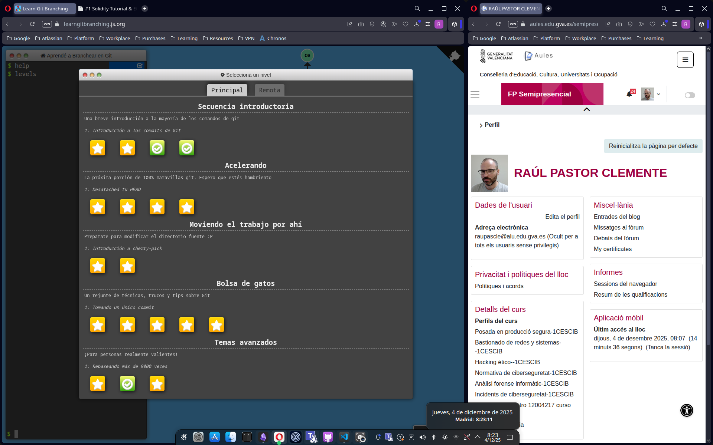
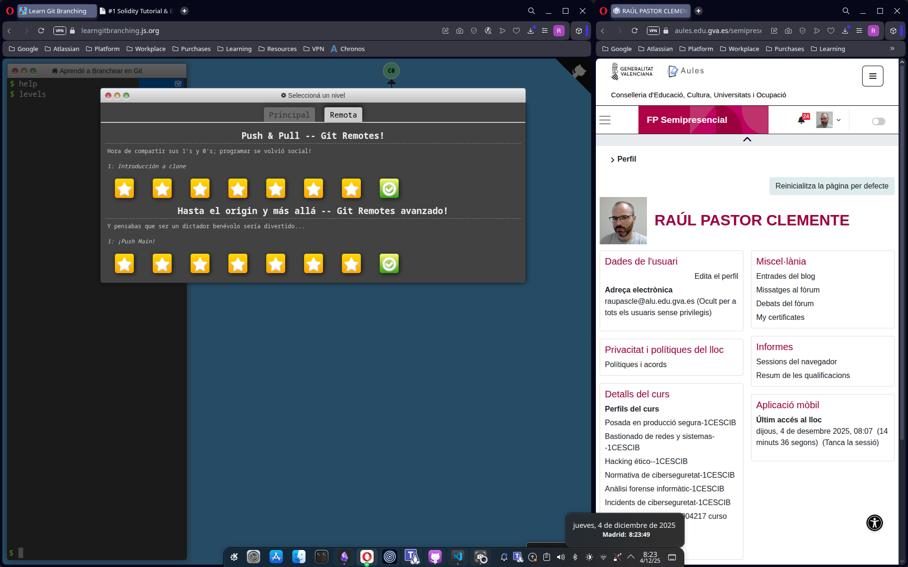

# Práctica Puntuable RA1 - Apartado 3

## Enunciado
Obtén un **pantallazo** de tus resultados obtenidos después de haber realizado el tutorial de la URL  
[https://learngitbranching.js.org/](https://learngitbranching.js.org/) que se solicitaba en la práctica de Aules **ACT_RA1_4: Solidity + GIT**.

Hay que obtener un pantallazo tanto para la pestaña **Main o Principal** como para la de **Remote o Remota**.  
En el pantallazo tiene que quedar claro de alguna forma que **el pantallazo lo hemos obtenido nosotros** y no es una imagen aleatoria.

## Capturas de pantalla

A continuación se adjuntan las capturas de pantalla que acreditan la finalización de los niveles solicitados. A fin de verificar la autoría, las capturas incluyen el entorno de escritorio con la fecha y hora del sistema visible.

### 1. Bloque Principal (Main)
Niveles completados de la pestaña main, principalmente gestión de ramas y movimientos avanzados en el árbol local.

### 2. Bloque Remoto (Remote)
Niveles completados de la pestaña remote, que profundizan en el uso de `push`, `pull`, `fetch` y la gestión de orígenes remotos.

## Conclusión
A través de este tutorial interactivo se han reforzado conceptos clave como el movimiento del puntero `HEAD`, la reescritura del historial con `rebase` y la sincronización con repositorios remotos, que son la base para el desarrollo colaborativo.