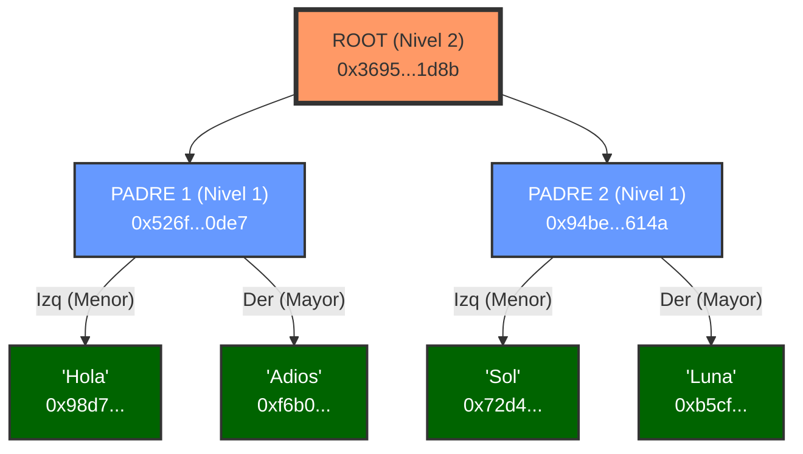
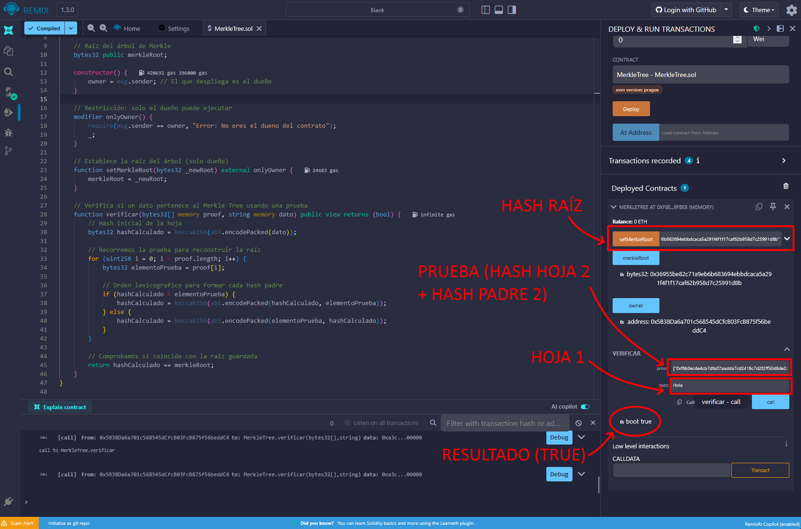

# Práctica RA1 - Apartado 4: Smart Contracts y Merkle Trees

## Enunciado
Obtén un **pantallazo** de tus resultados obtenidos después de haber realizado el tutorial **Solidity: Beginner to Intermediate Smart Contracts** de la práctica de Aules **ACT_RA1_4: Solidity + GIT**.

Al igual que en el apartado anterior, tiene que quedar claro que el pantallazo **se ha obtenido por nosotros** de nuestros resultados y no de otra fuente.

Realiza un **Smart Contract privado propio** que sea el inicio de una cadena que utilice los **árboles de decisión de Merkle (Merkle Trees)**.

## Parte 1: Tutorial de Solidity
A continuación se muestran las capturas que acreditan la finalización de los lecciones del tutorial interactivo,

### Captura de resultados

## Parte 2: Smart Contract con Árboles de Merkle
El objetivo es desarrollar un contrato inteligente que represente el inicio de una cadena basada en Merkle Trees. El contrato debe ser **privado**, es decir, que solo el propietario puede realizar ciertas operaciones críticas.

### ¿Qué es un árbol de Merkle?
Un Árbol de Merkle es una estructura de datos fundamental en blockchain que permite verificar la integridad de un gran conjunto de datos de manera eficiente y segura.

Funciona de la siguiente manera:
1.  **Hojas (Leaves):** Se toma cada dato individual (ej. "Hola", "Adios") y se genera su Hash.
2.  **Ramas (Branches):** Los hashes se agrupan en pares y se vuelven a hashear juntos.
3.  **Raíz (Root):** Se repite el proceso hasta que queda un único hash final, conocido como la **Merkle Root**.

### Funcionamiento del script
Este contrato implementa un **Verificador de Árbol de Merkle con Pares Ordenados**.

En lugar de almacenar una lista gigante de direcciones o strings en la blockchain (lo cual sería muy costoso en Gas), solo almacenamos una única huella digital de 32 bytes llamada **Merkle Root**.

Para demostrar que un dato ("Hola") está en la lista, el usuario envía el dato y una "prueba" (una lista de hashes vecinos). El contrato reconstruye la raíz matemáticamente y la compara con la almacenada.

### Árbol usado en la prueba

* **Hash Raíz:** 0x36955be82c71a9eb6b683694ebbdcaca5a291f4f1f17caf62b958d7c25991d8b
* **Hash Padre 1:** 0x526f73d5af96b1418eae80daff570b80500d7e9a45ada8c62ad39313b7500de7
* **Hash Padre 2:** 0x94be044a318f6e73a3706010582a05069f2d7743645b729c22166c81bffe614a
* **Hash Hoja 1 (Hola):** 0x98d72beb4bd8117253d41e6075451e4c62e8f4cb6538536ef1fc13333c7a4085
* **Hash Hoja 2 (Adios):** 0xf6b0ec4e4cb7dfa07aadda7cd2416c7d2f2ff50d8de2a83a44e89fcd74c6eee6
* **Hash Hoja 3 (Sol):** 0x72d49186752e2f27cd5b5a3914634770cd7b65f41c61797eeaa5fd582e9c49a9
* **Hash Hoja 4 (Luna):** 0xb5cf3f153eccb7e7cf70f80270b326abf80a7208aba2bff85a05da4ecda024b7

### Verificación en Remix IDE
