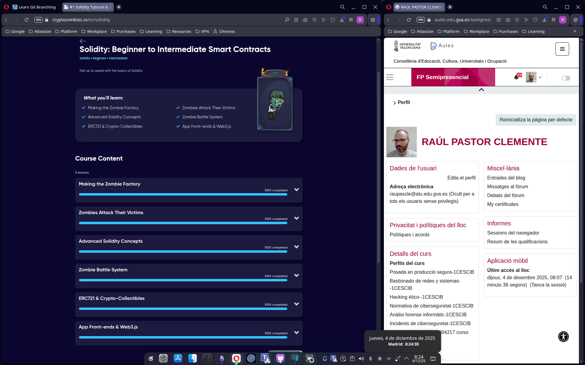

# Práctica RA1 - Apartado 4: Smart Contracts y Merkle Trees

## Enunciado
Obtén un **pantallazo** de tus resultados obtenidos después de haber realizado el tutorial **Solidity: Beginner to Intermediate Smart Contracts** de la práctica de Aules **ACT_RA1_4: Solidity + GIT**.

Al igual que en el apartado anterior, tiene que quedar claro que el pantallazo **se ha obtenido por nosotros** de nuestros resultados y no de otra fuente.

Realiza un **Smart Contract privado propio** que sea el inicio de una cadena que utilice los **árboles de decisión de Merkle (Merkle Trees)**.

## Parte 1: Tutorial de Solidity
A continuación se muestran las capturas que acreditan la finalización de los lecciones del tutorial interactivo,

### Captura de resultados

